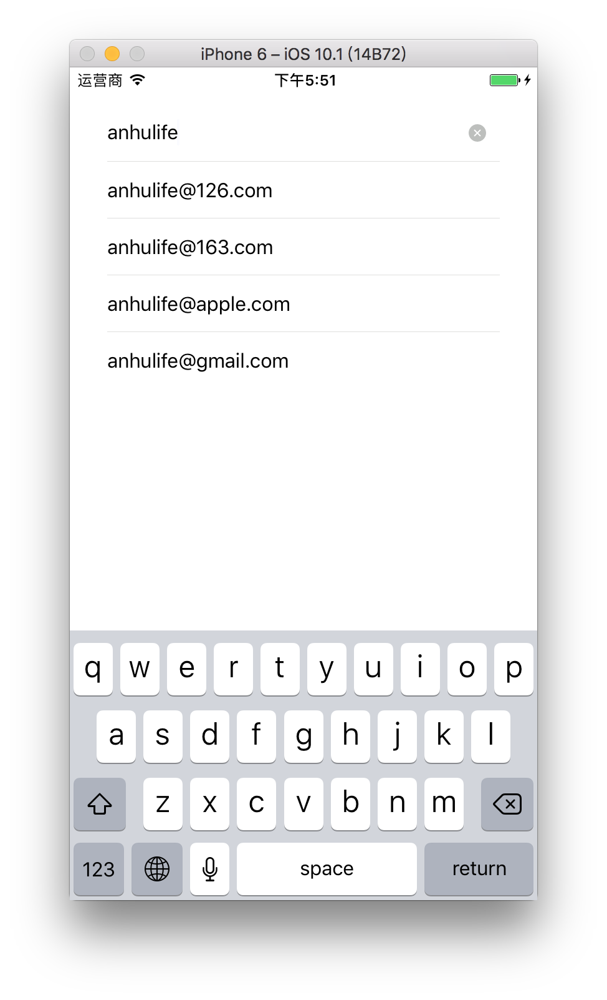

# Input2

适用于`React Native`的输入框组件。



## 特性

1. 输入建议
2. 清空输入
3. 扩展左右两端
4. 自定义样式

## 输入建议

启用输入建议很简单，只需要提供两个属性：`fetchSuggestions`和`onSelect`。

```react
<Input2
  value={this.state.value}
  onChangeText={text => this.setState({ value: text })}
  fetchSuggestions={text => (['anhulife@126.com', 'anhulife@163.com', ...])}
  onSelect={selected => this.setState({ value: selected })}
 />
```

每当文本输入框有内容变化时，`Input2`就会调用`fetchSuggestions`获取建议数组并渲染建议列表，当用户选择了建议列表中的其中一项，`Input2`就会将用户的选择项传入`onSelect`函数。

`fetchSuggestions`支持异步返回结果，只需要返回`thenable`对象或`Promise`实例即可。

`fetchSuggestions`返回的数组中每一项，可以是字符串也可以是对象。如果返回的是包含对象的数组，那么`onSelect`传入的参数也是对象。

建议列表中每个条目也可以自定义，使用`customItem(item, handleSelect)`即可。下面是默认的设置。

```react
(item, handleSelect) => (
  <TouchableWithoutFeedback onPress={handleSelect}>
    <View style={[styles.suggestion, userStyles.suggestion]}>
      <Text
        ellipsizeMode="middle"
        numberOfLines={1}
        style={[styles.suggestionText, userStyles.suggestionText]}
      >
        {item.value || item}
      </Text>
    </View>
  </TouchableWithoutFeedback>
)
```


## 清空输入

当用户在输入内容的时候，输入框右边会出现一个清空按钮，点击即可清空输入。想启用这个功能，也只需要提供两个属性：`showClearButton`和`onClear`。

```react
<Input2
  value={this.state.value}
  onChangeText={text => this.setState({ value: text })}
  showClearButton={!!this.state.value}
  onClear={() => this.setState({ value: '' })}
/>
```

当输入框聚焦并且`showClearButton`为`true`时，清空按钮就会出现，`onClear`会在用户点击清空按钮时调用。

## 扩展左右两端

如果需要在输入框的左边或右边追加别的内容，只需要传递`prependSlot`和`appendSlot`属性即可，这两个属性对应值的是可渲染的内容。

```react
<Input2
  value={this.state.value}
  onChangeText={text => this.setState({ value: text })}
  prependSlot={<Text>Hello</Text>}
  appendSlot={<Text>Hello</Text>}
/>
```

## 自定义样式

整个输入框组件都可以自定义样式，通过属性`styles`即可完成。

```javascript
const styles = StyleSheet.create({
  container: {
    backgroundColor: 'red',
  },
});

<Input2
  value={this.state.value}
  onChangeText={text => this.setState({ value: text })}
  styles={styles}
/>
```

以下是组件的默认样式。

```javascript
const pixelDensity = PixelRatio.get();
const fontSize = 32 / pixelDensity;
const itemHeight = 90 / pixelDensity;
const onePixel = 1 / pixelDensity;
const topOffset = 91 / pixelDensity;
const greyColor = '#dfdfde';

const styles = StyleSheet.create({
  // 容器
  container: {
    flexDirection: 'row',
    alignItems: 'center',
    position: 'relative',
    borderBottomWidth: onePixel,
    borderBottomColor: greyColor,
  },

  // 输入框
  input: {
    fontSize,
    height: itemHeight,
    flex: 1,
  },

  // 清空按钮
  clearButton: {
    width: 32 / pixelDensity,
    height: 32 / pixelDensity,
    margin: 20 / pixelDensity,
  },

  // 建议列表
  suggestions: {
    position: 'absolute',
    top: topOffset,
    left: 0,
    right: 0,
    maxHeight: 4 * itemHeight,
  },

  // 建议项
  suggestion: {
  },

  // 建议项的文本
  suggestionText: {
    fontSize,
    lineHeight: itemHeight,
  },

  // 建议项之间的分隔符
  suggestionSeparator: {
    borderBottomWidth: onePixel,
    borderBottomColor: greyColor,
  }
});
```

